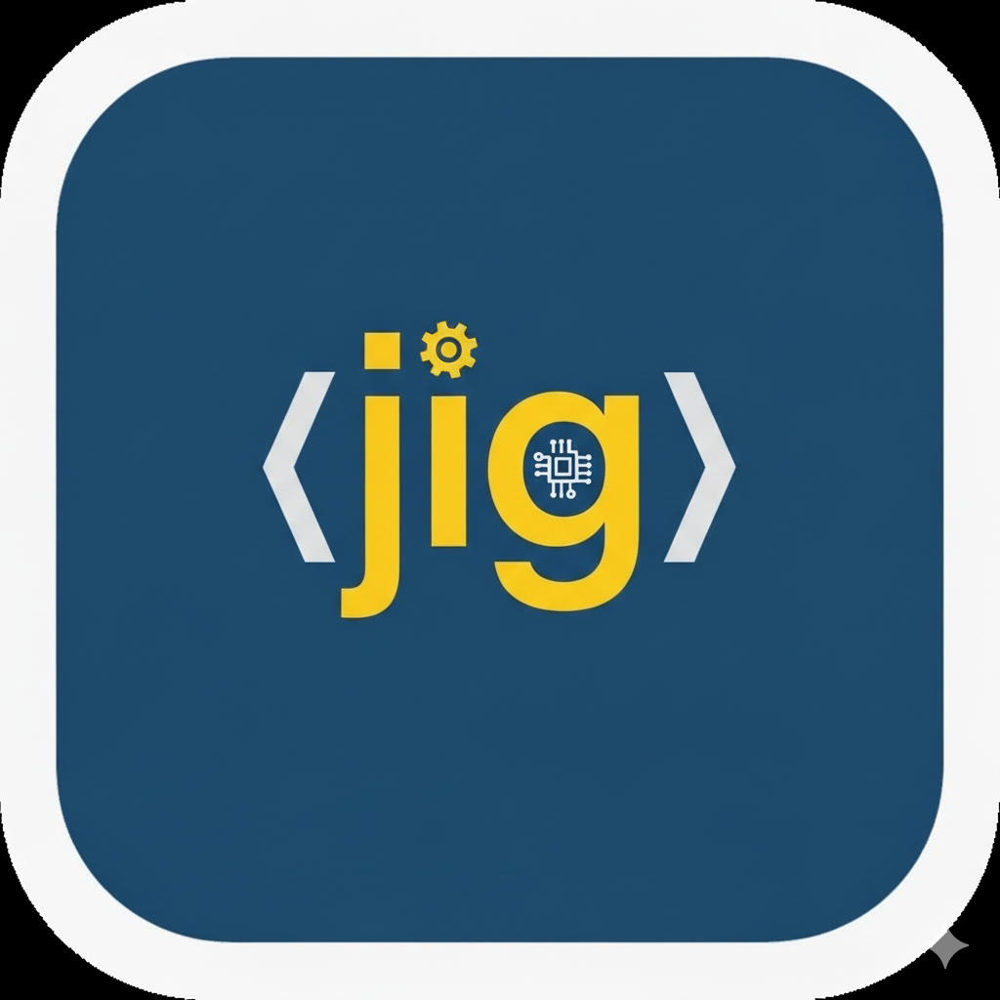

# jira-implementation-generator (jig)



----

jira-implementation-generator (jig) is a Go-based CLI tool that generates comprehensive implementation plans for Jira tickets using Google Vertex AI and Anthropic's Claude models. It fetches ticket details, processes them through customizable prompt templates, and produces detailed implementation strategies.

## Features

* **Automatic Ticket Analysis**: Fetches and parses Jira tickets with complete metadata
* **AI-Powered Planning**: Uses Claude Sonnet 4 to generate detailed implementation plans
* **Dual Template System**: Supports both Markdown (.md) and POML (.poml) prompt templates
* **Ticket Type Awareness**: Adapts output for Bug vs Story/Epic tickets automatically
* **Flexible Authentication**: Supports both anonymous access and Personal Access Tokens
* **Configurable Infrastructure**: Customizable Google Cloud regions and projects
* **Auto-Saved Output**: Implementation plans saved to `implementation-plans/` directory

Generated implementation plans include:
* Requirements analysis and ticket breakdown
* Solution approach and architecture considerations
* Step-by-step implementation guidance
* Testing strategy and verification steps
* Risk assessment and mitigation strategies
* Impact analysis on related systems

## Quick Start

### Build and Install
```bash
# Clone the repository
git clone https://github.com/joshbranham/jira-implementation-generator.git
cd jira-implementation-generator

# Build the binary
make build
```

### Basic Usage
```bash
# Get help
./jig --help

# Analyze a public ticket (anonymous access)
./jig RHEL-12345

# Use with Personal Access Token
./jig --token=your_pat_token RHEL-12345

# Use environment variable for token
export JIRA_TOKEN=your_pat_token
./jig RHEL-12345
```

## CLI Usage Examples

### Authentication Examples
```bash
# Anonymous access (public tickets only)
./jig RHEL-12345

# Using command line token (long form)
./jig --token=mytoken123 RHEL-12345

# Using command line token (short form)
./jig -t mytoken123 RHEL-12345

# Using environment variable
JIRA_TOKEN=mytoken123 ./jig RHEL-12345
```

### Custom Jira Instance
```bash
# Use different Jira instance
./jig --jira-base-url=https://my-company.atlassian.net PROJ-456

# Combined with authentication
./jig -t mytoken --jira-base-url=https://internal-jira.company.com TASK-789
```

### Google Cloud Configuration
```bash
# Custom region and project
./jig --region=us-central1 --project-id=my-gcp-project RHEL-12345

# Short form flags
./jig -r us-west1 -p my-project RHEL-12345

# All custom settings combined
./jig -t mytoken -r us-central1 -p my-project --jira-base-url=https://jira.company.com TASK-123
```

### Template Selection
```bash
# Use default POML template
./jig RHEL-12345

# Use custom template
./jig --template=my-custom-prompt.md RHEL-12345
```

## Configuration

### Default Settings
- **Jira Instance**: `https://issues.redhat.com`
- **Google Cloud Region**: `us-east5`
- **Google Cloud Project**: `itpc-gcp-hcm-pe-eng-claude`
- **AI Model**: `claude-sonnet-4@20250514`
- **Default Template**: `prompts/implementation-plan.md`

### Environment Variables
```bash
# Jira authentication
export JIRA_TOKEN=your_personal_access_token

# Google Cloud (if not using default project)
export GOOGLE_APPLICATION_CREDENTIALS=/path/to/service-account.json
```

## Authentication Setup

### Jira Personal Access Token
1. Navigate to your Jira profile settings
2. Go to "Security" → "Create and manage API tokens"
3. Create a new token with appropriate permissions
4. Use via `--token` flag or `JIRA_TOKEN` environment variable

### Google Cloud Authentication
Ensure you have Google Cloud credentials configured:
```bash
# Login to Google Cloud
gcloud auth login

# Set application default credentials
gcloud auth application-default login

# Or use service account key
export GOOGLE_APPLICATION_CREDENTIALS=/path/to/service-account.json
```

## Template System

### Markdown Templates (.md)
Simple text templates using Go's `text/template` syntax:
```markdown
# Implementation Plan for {{.Summary}}

**Ticket Type**: {{.IssueType}}
**Priority**: {{.Priority}}

## Analysis
{{.Description}}
```

### POML Templates (.poml)
Structured XML-like format with semantic elements:
```xml
<poml>
  <role>You are a software engineer...</role>
  <task>Create an implementation plan...</task>
  <context>
    <section name="ticket-information">
      <title>{{.Summary}}</title>
      <description>{{.Description}}</description>
    </section>
  </context>
</poml>
```

### Available Template Variables
- `{{.Summary}}` - Ticket title
- `{{.Description}}` - Ticket description
- `{{.Status}}` - Current status
- `{{.IssueType}}` - Issue type (Bug, Story, Epic, etc.)
- `{{.Priority}}` - Priority level
- `{{.Components}}` - Components (if any)
- `{{.Labels}}` - Labels (if any)
- `{{.Assignee}}` - Assigned user
- `{{.Reporter}}` - Reporter user

## Output

### Generated Files
Implementation plans are automatically saved to:
```
implementation-plans/{TICKET_ID}_{TIMESTAMP}.md
```

Example: `implementation-plans/RHEL-12345_20240917_143052.md`

### File Structure
```markdown
# Implementation Plan: Example Ticket Title

**Ticket ID:** RHEL-12345
**Generated:** 2024-09-17 14:30:52
**Status:** Open
**Type:** Story
**Priority:** Medium
**Assignee:** John Doe
**Reporter:** Jane Smith
**Components:** Security, Networking
**Labels:** urgent, p2

---

[Generated implementation plan content]
```

## Development

### Dependencies
```bash
# Download dependencies
go mod download

# Clean up dependencies
go mod tidy
```

### Building
```bash
# Build binary
make

# Build for different platforms
GOOS=linux GOARCH=amd64 go build -o jig-linux
GOOS=windows GOARCH=amd64 go build -o jig.exe
```

### Project Structure
```
├── main.go                    # Entry point with CLI and Vertex AI integration
├── pkg/
│   ├── jira/                 # Jira API client and ticket parsing
│   └── prompt/               # Template loading and rendering
├── prompts/                  # Prompt templates
│   ├── implementation-plan.md    # Default Markdown template
│   └── implementation-plan.poml  # POML structured template
└── implementation-plans/     # Generated output directory
```

## Troubleshooting

### Common Issues

**Authentication Errors**
```bash
# Verify Google Cloud auth
gcloud auth list
gcloud config get project

# Test Jira connection
curl -H "Authorization: Bearer $JIRA_TOKEN" https://issues.redhat.com/rest/api/2/issue/RHEL-12345
```

**Template Errors**
```bash
# Validate template syntax
./jig --template=my-template.md --help  # Will validate template on startup
```

**Network Issues**
```bash
# Test connectivity
curl https://issues.redhat.com/rest/api/2/issue/RHEL-12345
curl https://us-east5-aiplatform.googleapis.com/
```

## Contributing

1. Fork the repository
2. Create a feature branch: `git checkout -b feature-name`
3. Make your changes and add tests
4. Run tests: `go test ./...`
5. Submit a pull request
